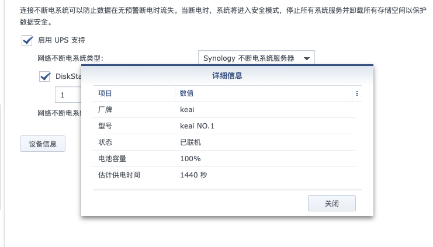
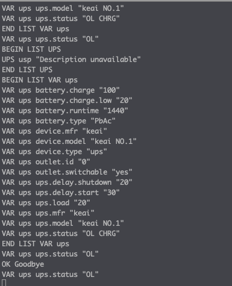

# ESP_UPS_demo
 模拟群晖不断电服务器协议 实现自制ups 接入群晖系统 欢迎各位大佬提供逆变方案
 * 平台 ESP8266 ARDUINO
 * 需要依赖wifi_link_tool
 * 黑群晖｜白群晖
 
 ### 序
 * 经过抓包等分析 发现群晖会去请求tcp 3493端口 
 * 后续深层解析 发现使用 telnet协议 
 * 创建telnet server 后发现 群晖向server发送了LIST UPS  十几秒后发送LOGOUT 群晖断开连接 
 * 通过在GitHub上检索LIST UPS、LOGOUT 找到了群晖使用的协议 NUT （Network UPS Tools）
 * 通过查看源码中的完整通信 模拟了该项目 为下一个项目做服务 
 
 ### 演示视频：
 
  ## 效果图
 
 
 
 
 ## 协议规范文档 [networkupstools](https://networkupstools.org/docs/developer-guide.chunked/ar01s09.html#_list)
 ## 完整通信协议 [nut_demo](https://github.com/networkupstools/nut/blob/master/data/evolution500.seq)
 * 本项目 进行了精简 群晖很多参数不会解析 
battery.charge: 90  
battery.charge.low: 30  
battery.runtime: 3690  
battery.voltage: 230.0  
driver.name: usbhid-ups  
driver.parameter.port: auto  
driver.version: 2.2.0  
driver.version.data: MGE HID 0.7  
driver.version.internal: 0.23  
input.frequency: 49.0  
input.transfer.boost.low: 184.0  
input.transfer.high: 294.0  
input.transfer.low: 160.0  
input.transfer.trim.high: 265.0  
input.voltage: 230.0  
outlet.desc: Main Outlet  
outlet.id: 0  
outlet.switchable: 0  
outlet.1.autoswitch.charge.low: 0  
outlet.1.delay.shutdown: -1  
outlet.1.delay.start: -1  
outlet.1.desc: PowerShare Outlet 1  
outlet.1.id: 1  
outlet.1.switch: 1  
outlet.1.switchable: 1  
outlet.2.autoswitch.charge.low: 0  
outlet.2.delay.shutdown: -1  
outlet.2.delay.start: -1  
outlet.2.desc: PowerShare Outlet 2  
outlet.2.id: 2  
outlet.2.switch: 1  
outlet.2.switchable: 1  
output.current: 0.00  
output.frequency: 49.0  
output.voltage: 230.0  
output.voltage.nominal: 230.0  
ups.delay.shutdown: -1  
ups.delay.start: -10  
ups.load: 10  
ups.mfr: MGE UPS SYSTEMS  
ups.model: Pulsar Evolution 500  
ups.power.nominal: 500  
ups.serial: AV2G3300L  
ups.status: OL CHRG  
ups.test.interval: 604800  
ups.test.result: Done and passed  

